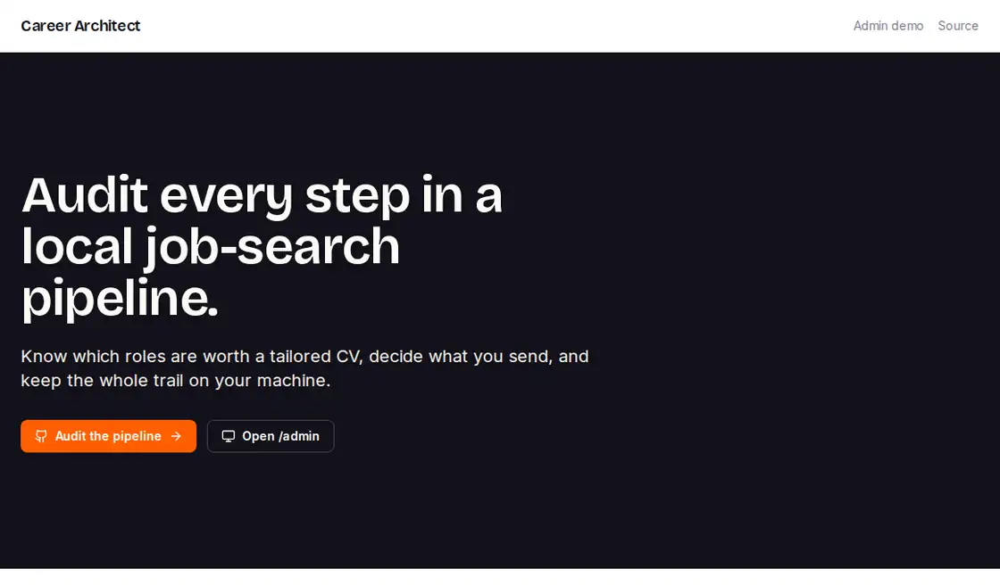
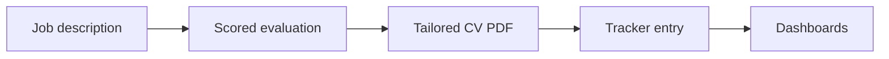
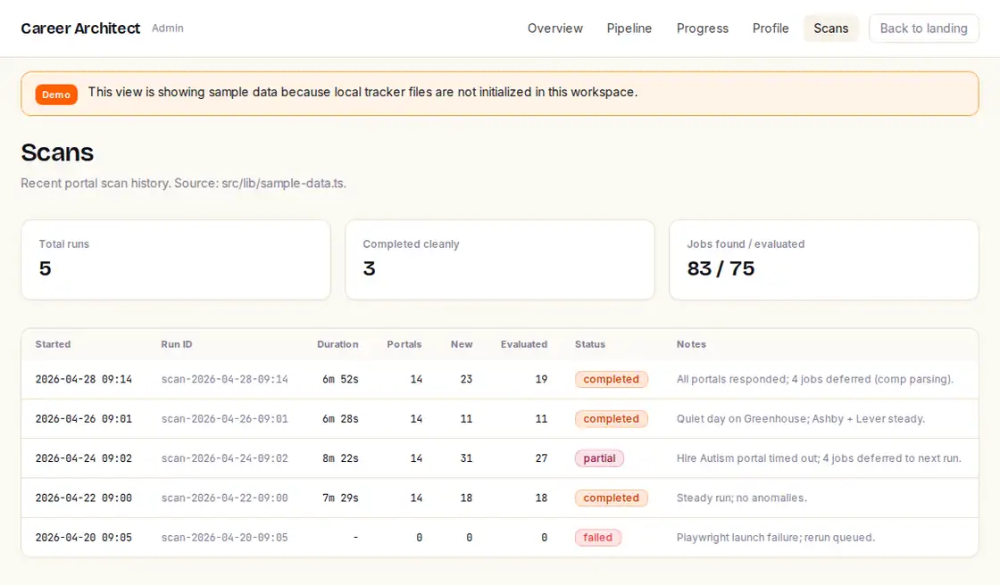

<div align="center">
<picture>
  <source media="(prefers-color-scheme: dark)" srcset="docs/brand/careerarchitect-wordmark-dark.png">
  <source media="(prefers-color-scheme: light)" srcset="docs/brand/careerarchitect-wordmark-light.png">
  
</picture>

#### jd scoring · tailored cv pdfs · portal scans · markdown tracker · six standalone clis · web + terminal dashboards

# paste a JD into Claude Code, get a scored evaluation, a tailored CV PDF, and a tracker entry

A fork of [santifer/career-ops](https://github.com/santifer/career-ops) with a Next.js landing page and coverage extensions for non-AI job categories.

**[Quick start](#-quick-start) | [Features](#-features) | [Use](#-use) | [Dashboards](#-dashboards) | [Fork map](UPSTREAM.md) | [Credits](#credits)**

### [🏗️ Clone it, then type `/career-ops` in Claude Code](#-quick-start)

Runs from your terminal against files you own. No server, no account, no database.

**❤️ [Sponsor this project](https://github.com/sponsors/wranngle) ❤️**

[](LICENSE)
[](https://github.com/wranngle/career_architect/releases)
[](https://github.com/wranngle/career_architect/commits/main)
[](https://github.com/wranngle/career_architect/graphs/contributors)

[](https://github.com/wranngle/career_architect/stargazers)
[](https://github.com/wranngle)
</div>

---



*The /admin pipeline view running on sample data.*

## What it does

Paste a job description and get a scored fit evaluation against your CV, plus a tailored ATS-clean PDF ready to submit. It scans your configured job boards for new postings and tracks every application in a plain markdown pipeline. The whole loop runs from your terminal against files you own.



## ✨ Features

- 📋 **JD in, decision out**: the `/career-ops` skill evaluates a pasted job description against your `cv.md` and profile, writes a scored report, and appends the tracker.
- 📄 **ATS-clean PDF**: `generate-pdf.mjs` renders a tailored CV variant per JD; `verify-pipeline.mjs` checks the loop end to end.
- 🗂️ **Portal scans by name**: configured queries for Ashby, Greenhouse, and Lever boards ship in `templates/portals.example.yml`, with non-AI board coverage in `templates/portals.extensions.yml`.
- 🧰 **Six standalone CLIs**: rehearse, tailor, negotiate, outreach, timeline, and learn-rejection each run as a plain npm script, no Claude session needed.
- 🖥️ **Two dashboards, one data model**: a web `/admin` surface and a Go TUI, both reading the same markdown tracker, both falling back to clearly labeled sample data when no tracker exists.
- 🎨 **One token file**: the web layer styles from `tokens/tokens.css` and the TUI's `wranngle` theme maps the same palette.
- 🧪 **Tested**: 126 unit tests and 82 integrity checks pass on `npm test`.

## 🚀 Quick start

1. Clone and install

   ```bash
   git clone https://github.com/wranngle/career_architect.git
   cd career_architect

   # Prereqs: Node >=20.19, Go >=1.24.2, Python >=3.11
   npm install
   npx playwright install chromium
   pip install -r requirements.txt
   ```

2. Configure your profile

   ```bash
   cp config/profile.example.yml config/profile.yml
   cp modes/_profile.template.md modes/_profile.md
   cp templates/portals.example.yml portals.yml
   # Optional: append sections from templates/portals.extensions.yml
   #           into portals.yml for non-AI board coverage.
   # Create cv.md with your master resume content.
   ```

3. Validate the environment

   ```bash
   npm run doctor
   ```

4. Open Claude Code in the repo and type `/career-ops`.

Personal data can also live in a separate directory instead of the repo: run any script from that directory and it resolves user-layer paths (cv.md, config/, data/, reports/, output/) against your CWD. See "Split-repo layout" in [`DATA_CONTRACT.md`](./DATA_CONTRACT.md).

## 🧰 Use

Get the job-search pipeline from JD intake to evaluation, PDF generation, tracker status, portal scans, follow-up checks, recruiter practice, CV tailoring, negotiation drafts, outreach messages, timelines, and rejection lessons.

### Inside Claude Code

```
/career-ops                       # show all subcommands
/career-ops <JD text or URL>      # auto-pipeline: evaluate -> PDF -> tracker
/career-ops scan                  # scan all enabled portals
/career-ops pdf                   # tailor cv.md for one JD, render PDF
/career-ops tracker               # pipeline status
/career-ops followup              # flag overdue follow-ups
```

Full list: `.claude/skills/career-ops/SKILL.md`.

### Standalone npm scripts

Six of the steps also run standalone, no Claude session needed. With npm scripts, CLI args go after `--`, e.g. `npm run tailor -- <jd.md>`.

<details>
<summary><b>Worked example: tailor a CV against the sample JD</b></summary>

```bash
npm run tailor -- fixtures/jd-sample.md
```

Every CLI runs the same way against the sample files in `fixtures/`, so you can try the whole toolbelt before touching your own data:

- `npm run rehearse` -> `node bin/rehearse.mjs`: 5-turn mock recruiter call. Usage: `npm run rehearse -- --company <slug> --mock <fixture.json> [--turns 5] [--root <dir>]`. The `--mock` flag is currently required (live recruiter client not wired).
- `npm run tailor` -> `node bin/tailor.mjs`: per-JD CV variant. Usage: `npm run tailor -- <jd.md> [--root <dir>] [--cv <cv.md>] [--out-dir <dir>]`.
- `npm run negotiate` -> `node bin/negotiate.mjs`: offer negotiation script generator. Usage: `npm run negotiate -- <offer.json> [--root <dir>] [--out-dir <dir>]`. Offer JSON must include `compensation.base_salary_usd`.
- `npm run outreach` -> `node bin/outreach.mjs`: cold-message generator. Usage: `npm run outreach -- <person.json> <jd.json> [--write] [--root <dir>] [--out-dir <dir>]`. Prints to stdout; `--write` also writes a file.
- `npm run timeline` -> `node bin/timeline.mjs`: application calendar built from `data/applications.md`. Usage: `npm run timeline -- [--root <dir>] [--out <path>] [--today YYYY-MM-DD] [--include ...] [--stdout]`. Writes `out/timeline.md` by default.
- `npm run learn-rejection` -> `node bin/learn-rejection.mjs`: rejection-feedback learner; extracts lessons from a rejection email into `data/lessons.md`. Usage: `npm run learn-rejection -- <rejection.md> [--root <dir>] [--lessons <path>] [--today <YYYY-MM-DD>] [--stdout]`.

</details>

## 📊 Dashboards

Two surfaces, one data model. Both read local career-ops files when they exist and fall back to clearly labeled sample data when the tracker is not initialized, so the first run always renders something honest.

### Web (`/admin`)

```bash
npm run dev
# then open http://localhost:3000/admin
```

Pipeline, Progress, and Scans screens plus a Profile readiness view, with a data banner on every page stating whether you are looking at live or demo rows.



*Scans screen, demo mode, banner on.*

### Terminal (Go TUI)

```bash
cd dashboard && go build -o ../career-dashboard .
../career-dashboard --path .. --theme=wranngle   # or catppuccin-latte / catppuccin-mocha / auto
```

See [`dashboard/README.md`](./dashboard/README.md) for the full theme and flag reference.

## 🧭 One pipeline, four surfaces

<table>
<tr>
<td align="center" width="25%"><b>Claude Code</b><br/>the <code>/career-ops</code> skill drives the whole loop conversationally</td>
<td align="center" width="25%"><b>Six CLIs</b><br/>rehearse, tailor, negotiate, outreach, timeline, learn-rejection</td>
<td align="center" width="25%"><b>Web /admin</b><br/>pipeline, progress, and scans in the browser</td>
<td align="center" width="25%"><b>Go TUI</b><br/>the same tracker, terminal-native</td>
</tr>
</table>

Every surface reads and writes the same plain markdown files, so nothing is locked in.

## 🔀 Why a fork

Upstream Career-Ops is tuned for senior AI/ML engineers searching Greenhouse, Ashby, and Lever. This fork adds non-AI portal coverage (`templates/portals.extensions.yml`), the Next.js landing page and `/admin` dashboard, and keeps upstream's architecture and license. [`UPSTREAM.md`](./UPSTREAM.md) maps what is upstream and what is local.

## 🗺️ Roadmap

| Item | State |
| --- | --- |
| CI gate running `npm test` on every push | next |
| `examples/` fixtures feeding the `/admin` demo rows directly | next |
| Live recruiter client for `rehearse` (mock fixtures drive it today) | next |

## Non-goals

Same as upstream: no database, no auto-submit, no background/job queues, no vector DB. Claude evaluates and tailors; you submit via Simplify.jobs or any other manual path.

## License

MIT, matching upstream. See [LICENSE](LICENSE).

## Credits

All non-trivial design credit belongs to Santiago Fernández de Valderrama ([@santifer](https://github.com/santifer)). This fork layers coverage extensions and a landing page on top. Fork-specific bug reports and feature requests go to [this repo's issues](https://github.com/wranngle/career_architect/issues); upstream questions route per [`SUPPORT.md`](./SUPPORT.md).
